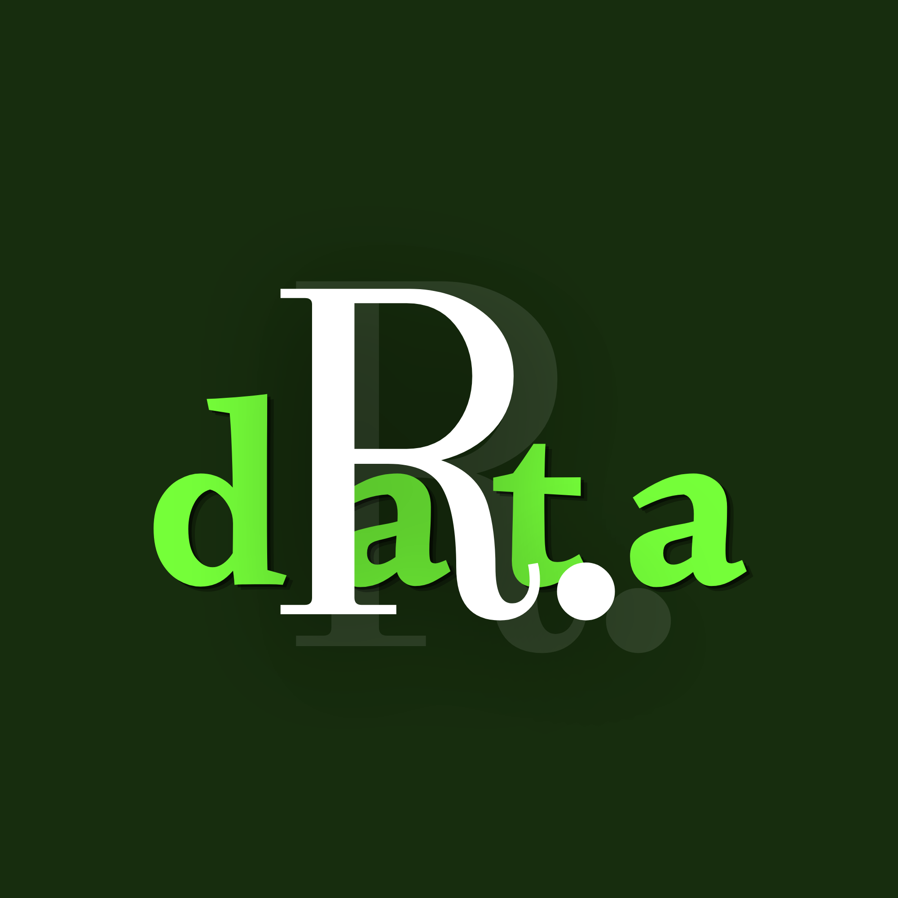

<div align="center">



# Rasul Mushtaq's Portfolio

**Personal portfolio for a Data Science student at the University of Baghdad.**

Check it out: [Rasul Mushtaq's Portfolio](https://Netlify.app.rasul-mushtaq-portfolio)

</div>

<div align="center">


</div>

---

A single-page site that shows my projects, skills, education, awards, and how to reach me. It ships in two languages (English and Arabic) with full RTL support, and everything on the page, from project cards to contact links, is driven by one data file.

## Features

- **One data source.** Projects, skills, honors, certifications, and both translation sets live in `src/data/portfolioData.ts`. Edit that file and the whole site updates.
- **English and Arabic.** A toggle in the navbar flips the language and sets `dir="rtl"` on the document. Arabic gets the body font instead of the italic serif accents, since serif italics don't work for Arabic letterforms.
- **Dark, minimal design.** Deep canvas background, one green accent, Instrument Serif for display type, Plus Jakarta Sans for body text.
- **Real project icons.** Skill and stack tags render brand SVGs (Python, TensorFlow, React, ...) from a small vendored copy of Simple Icons, with Lucide icons as fallbacks. No icon CDN, no extra dependency.
- **Mobile friendly.** The navbar collapses into a slide-down menu on small screens, and every section reflows cleanly down to phone widths.
- **Fast and static.** No backend, no runtime dependencies beyond React. The whole thing is a handful of static files.

## Tech Stack

| Layer      | Choice                                          |
| ---------- | ----------------------------------------------- |
| Framework  | React 18                                        |
| Language   | TypeScript                                      |
| Build tool | Vite 6                                          |
| Styling    | Tailwind CSS 4 (theme via `@theme` + `@config`) |
| Icons      | Lucide React + vendored Simple Icons paths      |

## Getting Started

You need Node.js 18 or newer.

```bash
git clone https://github.com/Rasul-Mushtaq/rasul-mushtaq-portfolio.git
cd rasul-mushtaq-portfolio
npm install
npm run dev
```

The dev server starts at `http://localhost:5173`.

### Scripts

| Command           | What it does                               |
| ----------------- | ------------------------------------------ |
| `npm run dev`     | Start the dev server with hot reload       |
| `npm run build`   | Type-check with `tsc` and build to `dist/` |
| `npm run preview` | Serve the production build locally         |

## Project Structure

```
portfolio/
├── public/                  # Static assets served as-is (CV, photos, crests)
├── src/
│   ├── components/          # One component per page section
│   │   ├── Hero.tsx         # Portrait, intro, resume CTA, social links
│   │   ├── Navbar.tsx       # Fixed pill nav, mobile menu, language toggle
│   │   ├── Projects.tsx     # Featured project cards
│   │   ├── Skills.tsx       # Skill groups as icon-labeled chips
│   │   ├── Education.tsx    # Degree details with university crests
│   │   ├── Honors.tsx       # Awards and recognitions
│   │   ├── Certifications.tsx
│   │   ├── Contact.tsx      # Email, phone, location, socials
│   │   ├── Footer.tsx
│   │   ├── SectionHeading.tsx
│   │   ├── TechIcons.tsx    # Maps skill names to brand SVGs
│   │   └── techIconData.ts  # Vendored Simple Icons paths
│   ├── context/
│   │   └── LanguageContext.tsx  # EN/AR state, document dir syncing
│   ├── data/
│   │   └── portfolioData.ts     # All content and translations live here
│   ├── App.tsx              # Page layout
│   ├── index.css            # Theme tokens and base styles
│   └── main.tsx             # Entry point
└── tailwind.config.js       # Brand palette and font stacks
```

## Customizing

Most changes need exactly one file:

- **Your content:** edit `src/data/portfolioData.ts`. Profile info, projects, skill groups, and the full English and Arabic translations are all in there. Project titles and descriptions are keyed by project `id`, so the two languages stay in sync.
- **Colors and fonts:** the palette and font stacks are defined twice on purpose, once in the `@theme` block in `src/index.css` and once in `tailwind.config.js`. Change both if you rebrand.
- **Resume:** replace `public/Rasul_Mushtaq_CV.pdf` with your own.
- **Photos and crests:** swap the files in `public/` (keep the same names).

## Deployment

The build output in `dist/` is plain static files, so it deploys anywhere: Netlify, Vercel, GitHub Pages, or a plain web server. For Netlify, point it at the repo with `dist` as the publish directory and `npm run build` as the build command.

## Contact

- **Email:** [rasul.mhussien@gmail.com](mailto:rasul.mhussien@gmail.com)
- **GitHub:** [github.com/Rasul-Mushtaq](https://github.com/Rasul-Mushtaq)
- **LinkedIn:** [linkedin.com/in/rasul-mushtaq](https://linkedin.com/in/rasul-mushtaq)
